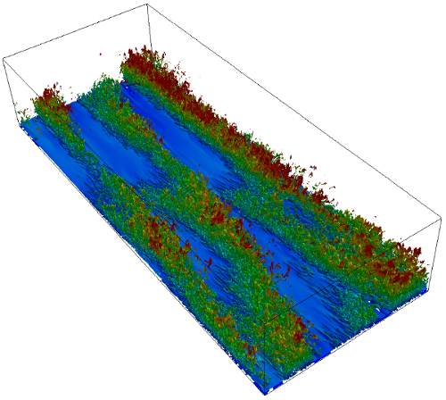

Home
====

HERCULES: A High-order Finite-difference Solver for Incompressible Boundary Layer Flows
---------------------------------------------------------------------------------------

HERCULES is an open-source computational fluid dynamics (CFD) code for simulating incompressible boundary layer flows. HERCULES is developed for high-performance turbulence simulations, and it can be used to conduct direct numerical simulation (DNS) of neutrally and stably stratified turbulent open-/closed-channel flows, as well as Ekman layer flows. HERCULES is written in Fortran 90. It has been tested on a number of HPC systems, e.g., ARL HPC Excalibur, AFRL HPC Lightening, and TACC Stampede, and is shown to have excellent parallel efficiency with up to 10,000 CPU cores. 

HERCULES is configured for turbulent channel flow simulations in a rectangular wall-bounded domain with periodic boundaries in the horizontal directions. It solves the Navier-Stokes equations and the temperature equation using a high-order finite-difference approach. Spectral discretization can also be used for horizontal derivatives. 

The HERCULES repository comprises of five main directories:

- doc: documentation
- license: license files
- misc: some utilities for pre-processing
- src: HERCULES source code
- tutorials: sample DNS simulations

Contents:

.. toctree::
   :maxdepth: 2

   self
   Download
   Installation
   Tutorials
   Development
   Contact

